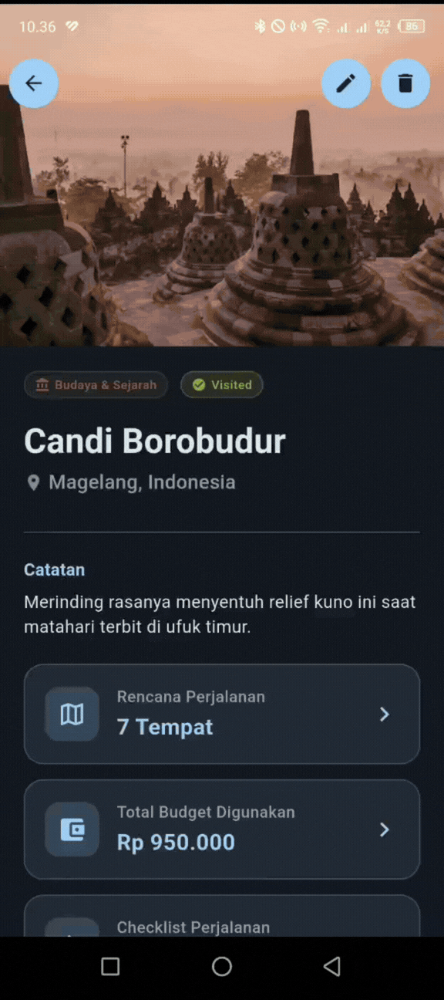
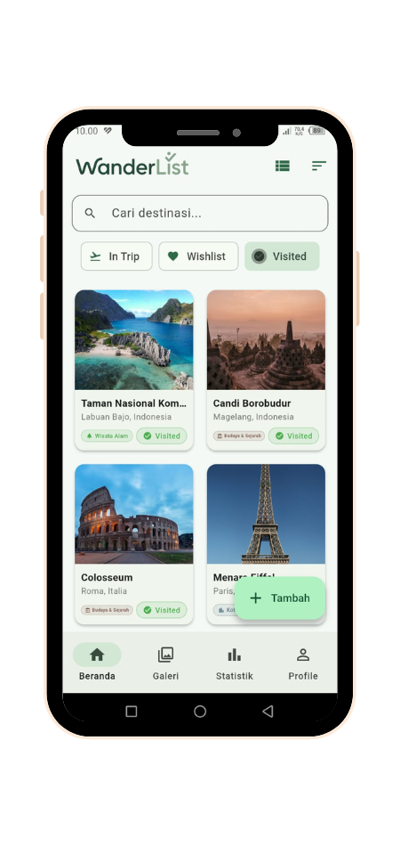
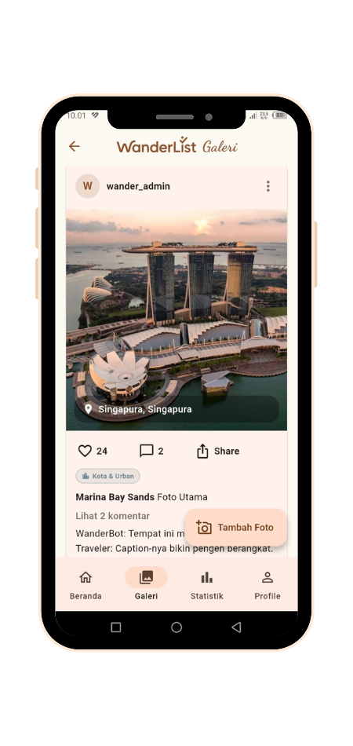
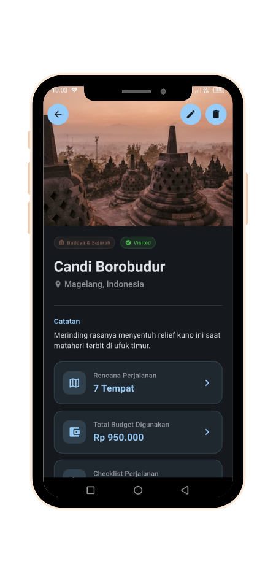
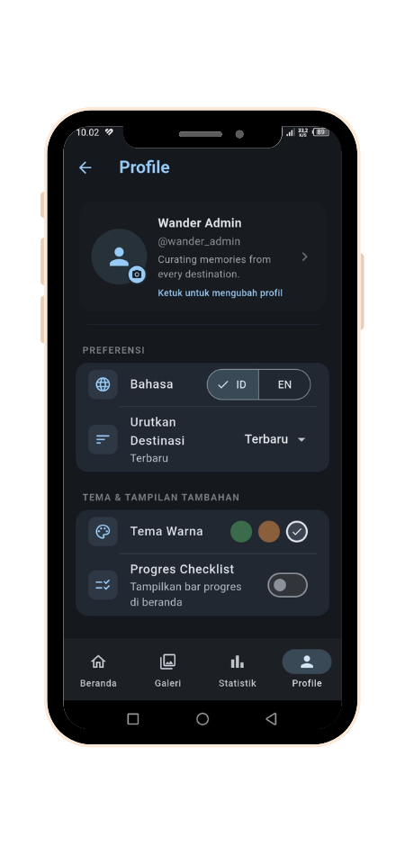

<p align="center">
  
</p>

# WanderList - Comprehensive Travel Planner & Dream Board

WanderList is a full-featured Flutter application designed to solve the chaos of travel planning. It acts as both an actionable itinerary manager and a personal dream board for travelers.

## 🚧 Problem & Solution

**The Problem**: Planning a trip often involves juggling multiple apps—one for maps, one for budgeting, a notes app for itineraries, and a separate gallery for memories. This fragmentation leads to disorganized travel experiences.

**The Solution**: WanderList consolidates the entire travel lifecycle into a single, offline-first application. From adding a destination to your wishlist and scratching it off, to planning day-by-day itineraries with route mapping, managing budgets, and sharing memories on a localized social feed.

## ✨ Key Features

- **🗺️ Interactive Trip Planner & Routing**: Plan your day-by-day itinerary with exact coordinates. Integrated with OpenRouteService and `flutter_map` to visualize your travel routes offline and calculate travel times.
- **🌦️ Weather Integration**: Real-time weather forecasts for your destinations using OpenWeather API.
- **💰 Budget Management**: Track your travel expenses categorized by activities, accommodation, food, and more.
- **📸 Social Gallery Feed**: A localized photo feed to document your travel memories, complete with captions and author tracking.
- **🎲 Interactive UI (Scratch Cards)**: Gamified experience for destinations on your wishlist—scratch to reveal the destination once visited!
- **🗄️ Robust Offline Database**: Powered by `sqflite` with a complex relational schema managing destinations, trip stops, budgets, checklists, and user profiles.
- **⚙️ Dynamic Theming & Localization**: Supports multiple themes (Canopy, Ancient Earth, Urban Slate) and multi-language support (ID/EN) managed via `shared_preferences`.

## 🛠️ Tech Stack

- **Framework**: [Flutter](https://flutter.dev/) (Dart)
- **Database**: SQLite (`sqflite`, `sqflite_common_ffi_web`)
- **Maps & Routing**: `flutter_map`, `latlong2`, OpenRouteService API
- **State Management**: Built-in `ValueNotifier` for global app state (Themes, Locale, Currency)
- **Local Storage**: `shared_preferences`
- **Other Core Packages**: `http`, `flutter_dotenv`, `image_picker`, `google_fonts`

## 🚀 Getting Started

### Prerequisites
- Flutter SDK `^3.10.4`
- Dart SDK

### Installation

1. Clone the repository:
   ```bash
   git clone https://github.com/Haykal-9/ass-pbbl.git
   cd ass-pbbl
   ```

2. Install dependencies:
   ```bash
   flutter pub get
   ```

3. Setup Environment Variables:
   - Rename `.env.example` to `.env` (or create a `.env` file in the root directory).
   - Add your API keys:
     ```env
     OPENWEATHER_API_KEY=your_openweather_api_key
     ORS_API_KEY=your_openrouteservice_api_key
     ```

4. Run the app:
   ```bash
   flutter run
   ```

## 🎥 Live Demo & 📸 Screenshots

### Live Demo
<p align="center">
  
</p>

### App Screenshots
<p align="center">
  &nbsp;&nbsp;
  
</p>
<p align="center">
  &nbsp;&nbsp;
  
</p>

## 📂 Project Structure

Following a clean architecture approach, the codebase is organized to maintain a clear separation of concerns:

- `lib/models/`: Data classes representing DB tables (Destination, TripStop, BudgetItem, etc.)
- `lib/screens/`: UI Views (HomeScreen, DetailScreen, TripPlanner, SocialGallery, etc.)
- `lib/services/`: Business logic, API calls, and DB operations (`database_helper.dart`, `preferences_service.dart`)
- `lib/widgets/`: Reusable UI components (DestinationCard, StatCard, etc.)

## 🧪 Testing

The project includes widget and interaction tests to ensure UI reliability, particularly for custom interactive widgets like the Scratch Card.

```bash
flutter test
```

## 📜 License

This project is created for educational and portfolio purposes.
